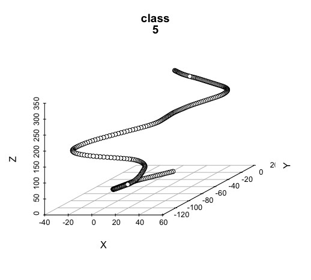
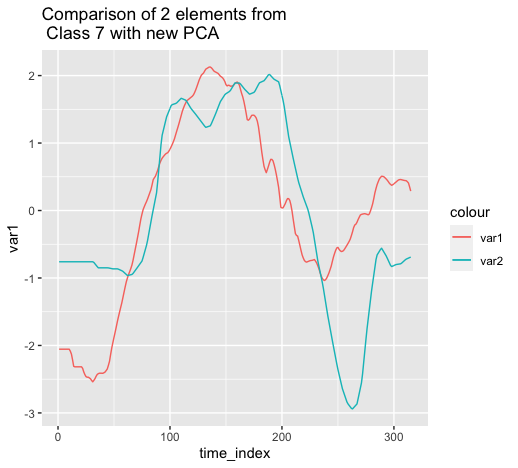

```{r setup, include=FALSE}
knitr::opts_chunk$set(echo = TRUE)
```
## Dimensionality Reduction for Time Series Data

## Part a
After reading data, I calculated velocity from acceleration data. Then plotted 3d scatterplot with scatterplot3d function from "scatterplot3d library".





## part b

First I've created the data frame as explained in the homework pdf. Then calculated PCA with built in prcomp funciton. Also I checked the variance too see explanation rates. Then I splitted the main dataframe with respect to groups and choose 2 random elements from each group. Here are the plots of two elements from each class:


## part c
As I have already splitted the data, now I redo the PCA process and here are the comparison graphs of the same two element tuples:





## part d

I've the built in dist function to calculate each axis then take their euclidean distance to create the main distance matrix. Then using cmdscale function, I plotted the 2d feature space:


Observations:

We can see some regions with almost all elements from the same class:

Left        : Class 5
Down        : Class 7
Middle-left : Class 8
Right       : Class 1 & 6

Also we can see that some of the classes are clumped up:

Class 2 is almost contained with the box [-20,-250]x[230,0]

Elements of Class 8 have dim2 value between -250 and 0.

(We can see more deductions such as class 4 having all but one element with positive dim2 value and so on)

