Homework 2 Results
================

## Dimensionality Reduction for Time Series Data

## Part a

After reading data, I calculated velocity from acceleration data. Then
plotted 3d scatterplot with scatterplot3d function from “scatterplot3d
library”.

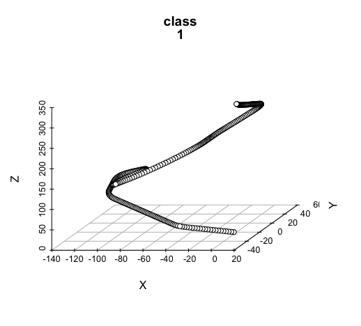 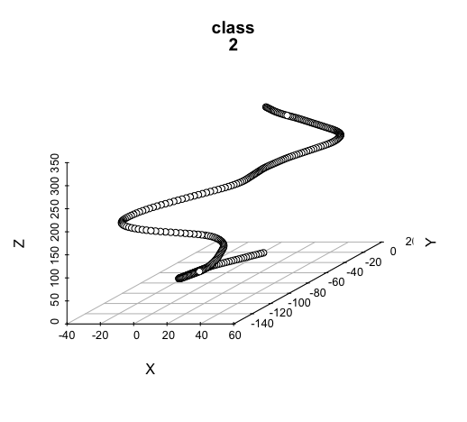 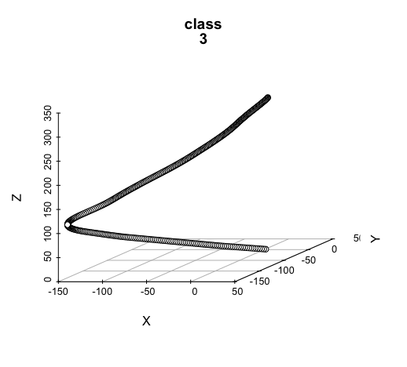 
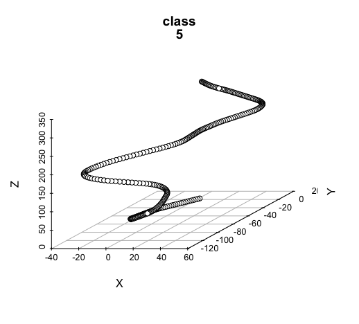   

## part b

First I’ve created the data frame as explained in the homework pdf. Then
calculated PCA with built in prcomp funciton. Also I checked the
variance too see explanation rates. Then I splitted the main dataframe
with respect to groups and choose 2 random elements from each group.
Here are the plots of two elements from each class: 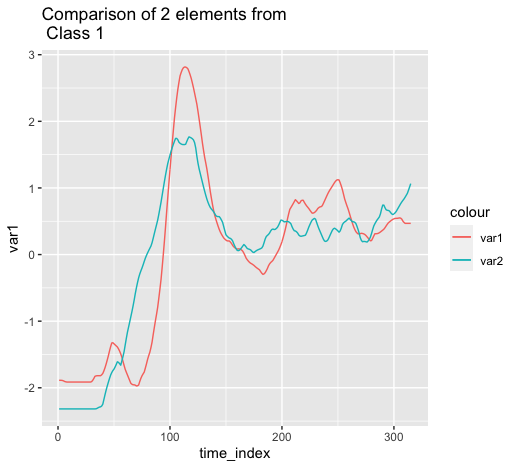
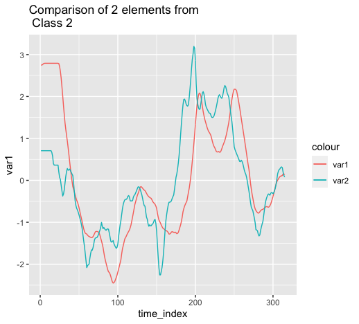 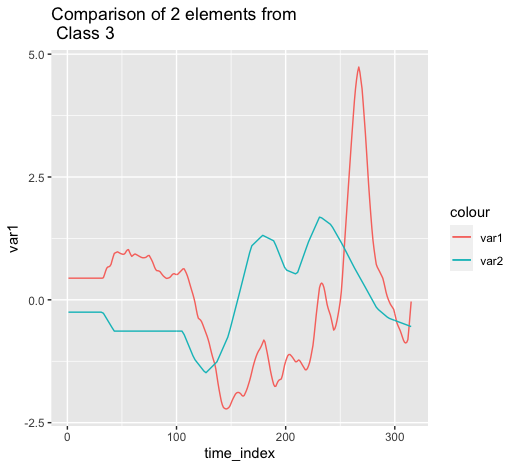 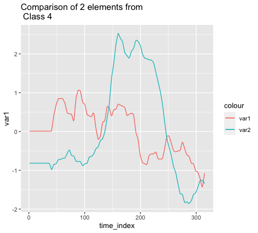 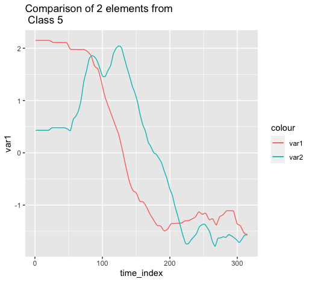 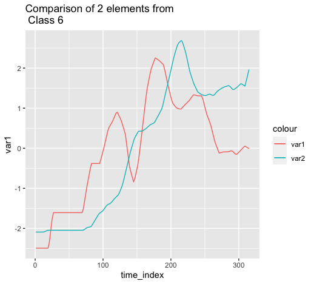 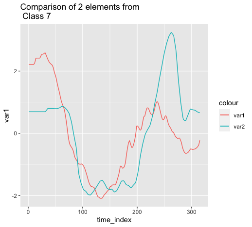

## part c

As I have already splitted the data, now I redo the PCA process and here
are the comparison graphs of the same two element tuples:

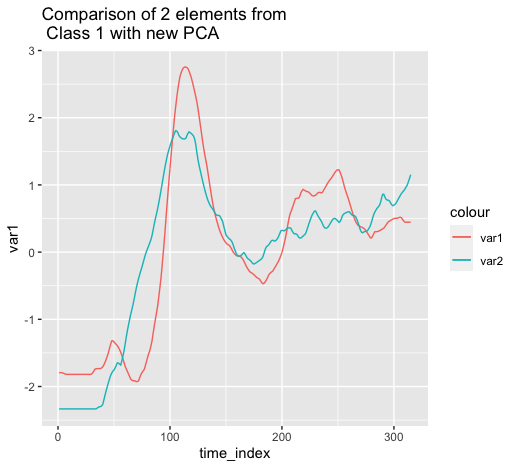 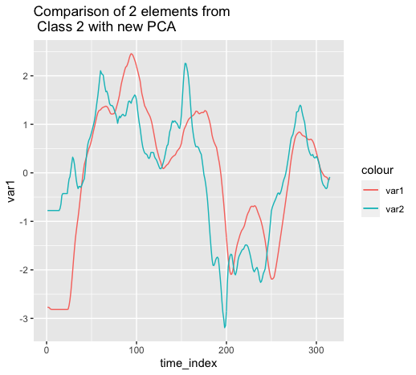  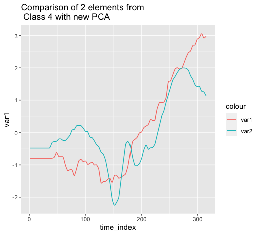 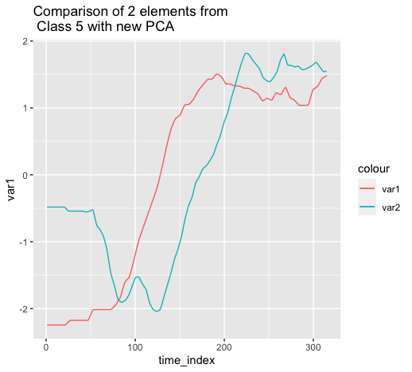 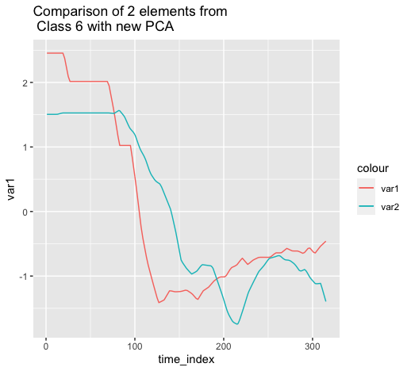
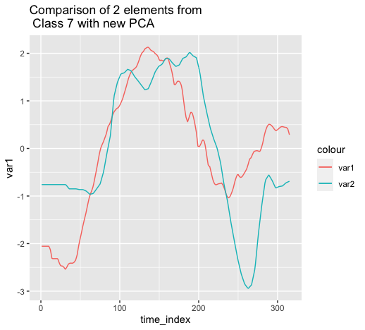 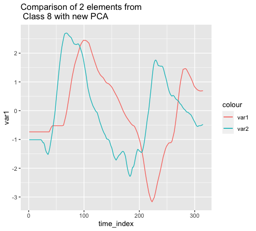

## part d

I’ve the built in dist function to calculate each axis then take their
euclidean distance to create the main distance matrix. Then using
cmdscale function, I plotted the 2d feature space:

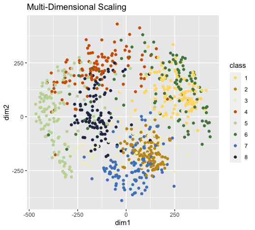

Observations:

We can see some regions with almost all elements from the same class:

Left : Class 5 Down : Class 7 Middle-left : Class 8 Right : Class 1 & 6

Also we can see that some of the classes are clumped up:

Class 2 is almost contained with the box \[-20,-250\]x\[230,0\]

Elements of Class 8 have dim2 value between -250 and 0.

(We can see more deductions such as class 4 having all but one element
with positive dim2 value and so on)
