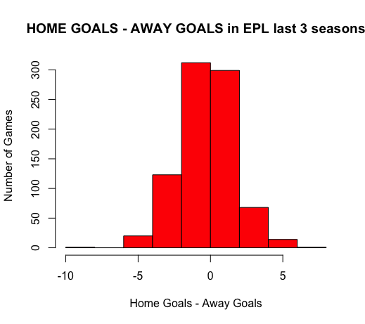

  ```{r,echo=FALSE,results="hide"}
library(knitr)
opts_chunk$set(tidy.opts=list(width.cutoff=60),tidy=TRUE)
```

**Task 1.**

After reading the data from csv file and combining them using 'rbind' and/or 'bind_rows'(from dplyr library), we can easily plot the histograms:

  

For the second part, adding the Poisson distribution with lambda equal to the mean and changing the Number of Games(y) part to ratio we get the following functions:

 

We can see that there is a correlation. It is also easy to explain: as we are counting the number of goals scored in almost same time intervals, expecting a distribution like poisson is reasonable.

**Task 2.**

For the second task, I've chosen the 4 bookmakers coded as: B365, BW, IW and PS. 

1/odd should normally give us the probability of the selected bet but as bookmakers put some marigin for their profit, we should also normalize it.

I also have added another column to the EPL data, odd_diff, which keeps the difference between the odds of home victory and away victory. Then plotting the graph of P(Home)-P(Away)~P(Draw) with the normalized probabilities, we get:


Then I have created 10 equal sized partitions between [-1,1]. I've categorized the games ... their draw probability to corresponding partition. Then summing the games that ended in draw and dividing it to the size of the partition we get:


(The dark points represent the probability calculated, the red points represent the actual results of each partition.)


Here we can see that in all the bookmakers, the bin [0,0.2) is quite interesting. In that bin, bookmakers underestimate the probability of draw. These games are can be explained, very roughly, as the games where the home team is a little favorable than the away team. With more investigation one may earn money in the long run if they place their bets for draw.


**Task 3.**

Also we can remove the games with red cards in them. As the data we have does not contain the information of the bookings time, I will delete all the games with at least one red card. As the both four graps are similar, I will only show the first(B365) one:

 

Doing so increases the ratio of draws in some of the bins. Also here is a table for comparison:


Note that, in 7 out of 9 bins, excluding the empty, there is an increase in the outcome.

We can also see that the red dot in the (0,0.2] bin is higher than the all black dots. This means that, in such games with no red cards given, betting on a draw can really be profitable in the long run. 

However, one cannot know whether there will be a red card in a game or not. Also a red card can be given right after a penalty or in a game where one of the sides have already secured the win. Therefore one should be really careful with their calculations. Also, placing bets on a draw and a red card(with a smaller amount) is also a strategy worth checking. 